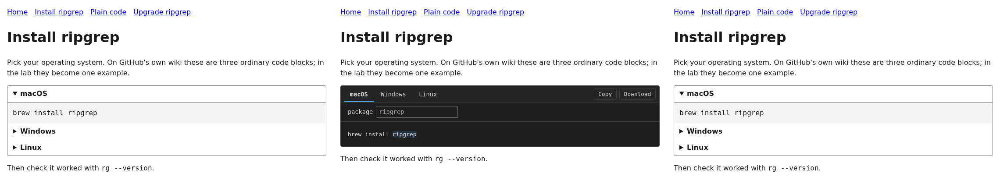

<!-- SPDX-License-Identifier: MPL-2.0 -->
# berry-blocks

**An integration lab and the start of a plugin host for BerryWiki. Its first
plugin is ProgBlocks.**

berry-blocks depends on [BerryWiki](https://github.com/metadatastician/berrywiki)
and [ProgBlocks](https://github.com/metadatastician/progblocks). Neither of them
depends on berry-blocks, and neither depends on the other. If this repository
disappeared tomorrow, both would keep working unchanged. See
[ADR-0001](docs/decisions/ADR-0001-independence-and-pins.adoc).



*One Markdown page, rendered three ways: static profile (no script), enhanced
profile with JavaScript, and enhanced profile with JavaScript turned off.*

## What it does today

Authors mark variants on ordinary fenced code blocks. GitHub's own wiki still
shows these as plain code blocks:

````markdown
```bash variant=macOS group=os persist label="Operating system"
brew install {{ package = ripgrep }}
```

```bash variant=Linux group=os
sudo apt-get install {{ package = ripgrep }}
```
````

`berry-blocks render` turns a BerryWiki folder into HTML pages in one of two
profiles:

| Profile | What readers get | Script |
|---|---|---|
| `static` | Each variant is a native `<details>` section inside a labelled group, with defaults filled in. It is compatible with BerryWiki's no-script rule. | none |
| `enhanced` | The same static markup wrapped in `<prog-block>`. With JavaScript it becomes tabs with editable variables, Copy and Download, and the choice persists. Without JavaScript it looks the same as `static`. | ProgBlocks, about 21 kB, fetched once |

BerryWiki stays the renderer. The host swaps each variant run for a one-off
marker and lets `berrywiki_render::render_markdown` render the page. It then
replaces each marker with the block's HTML. A conformance test requires every
page of BerryWiki's own fixture wiki to come out **byte-identical** to
BerryWiki's render.

## Try it

```sh
./scripts/fetch-pins.sh          # BerryWiki + ProgBlocks at the commits in pins.kyaml
cargo test --workspace           # host, block, conformance and pin tests
cargo run -p berry-blocks -- render --profile static   fixtures/lab-wiki out/static
cargo run -p berry-blocks -- render --profile enhanced fixtures/lab-wiki out/enhanced
bun install && CHROMIUM_PATH=/path/to/chrome bun tools/check-pages.mjs out/static out/enhanced
```

Open `_pages.html` for the page list. Serve `out/enhanced` over HTTP to see the tabs; browsers do not run module
scripts from `file://`.

## Documents

| Document | What it answers |
|---|---|
| [ADR-0001](docs/decisions/ADR-0001-independence-and-pins.adoc) | The independence rules and how pins work |
| [ADR-0002](docs/decisions/ADR-0002-plugin-contract.adoc) | The plugin contract (draft) and the road to the plugin wizard |
| [Static vs enhanced report](docs/reports/2026-10-05-static-vs-enhanced.adoc) | The measured comparison of the two models |
| [Proposal to BerryWiki](docs/proposals/berrywiki-codefence-hook.adoc) | The one small interface that would remove the lab's workaround |

## Status

This is a lab. Nothing here is released. BerryWiki does not serve these pages:
its plan lists plugins as a v1 non-goal, and ADR-0003 and ADR-0007 forbid
hand-written script in anything it serves. berry-blocks is where the plugin
system is designed and tested before BerryWiki decides whether to adopt any of
it.

Licence: [MPL-2.0](LICENSE).
